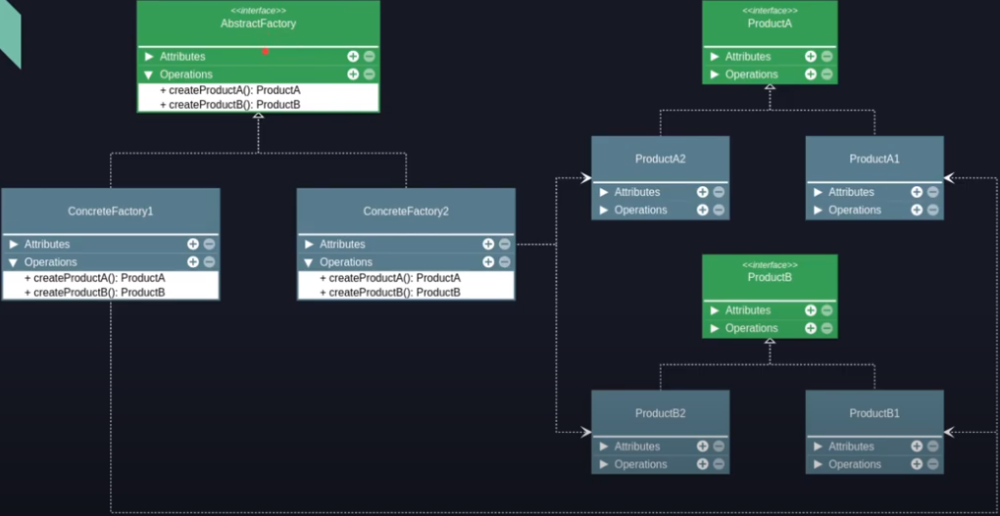

# Design Patterns

## Padrões de Criação

### Abstract Factory
 * `Propósito:` 
   >- Fornecer uma interface para criação de famílias de objetos relacionados ou dependentes sem especificar suas classes concretas.
 * `Projeto de estudos:` 
   >- 
 * `Vantagens:` 
   >- Os produtos sempre serão compatíveis entre si.
   >- Aplicação clara do Open/Closed Principle, é fácil adicionar novas fábricas e produtos.
   >- Aplicação clara do Single Responsability Principle, o código que cria está separado do código que usa os objetos.
 * `Desvantagens:`
   >- Muitas classes e aumento na complexidade introduzida no código.
   
   
 * `Exemplo de uma fábrica abstrata:`

 

teste1